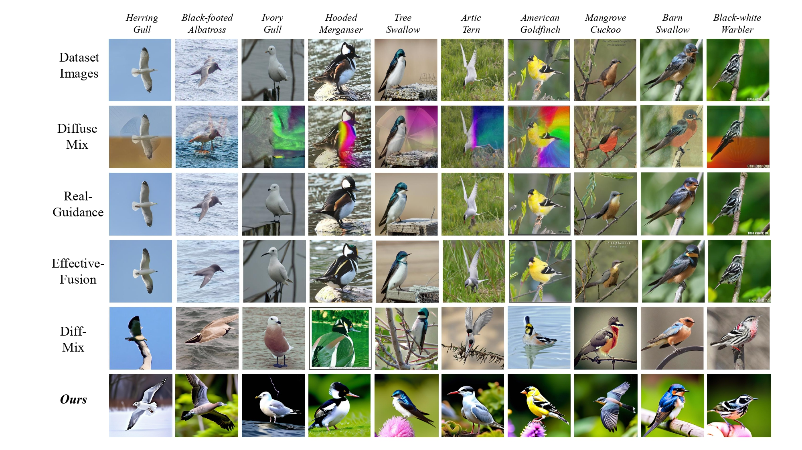

# DiffCoRe-Mix : Context-Guided Responsible Data Augmentation with Diffusion Models [ICLRw-2025]
<p align="center">
    
</p>

<p align="center">
  <a href="https://arxiv.org/pdf/2503.10687"></a>&nbsp;&nbsp;
  <a href="https://github.com/khawar-islam/DiffCoRe-Mix"></a>&nbsp;&nbsp;
  <a href="LICENSE"></a>
</p>

#### [Khawar Islam](mailto:khawar.islam@student.unimelb.edu.au), [Naveed Akhtar](mailto:naveed.akhtar1@unimelb.edu.au)
#### **School of Computing and Information Systems, The University of Melbourne**


### 📢 Latest Updates
- **Mar-15-25**: Preprint is available.
- **Mar-13-25**: Public release of the code and models.
- **Mar-12-25**: Paper accepted at **ICLRw-2025**.


---


### Key Features

- **Contextual & Negative Prompting:** Guides the diffusion process to generate domain-specific images while suppressing undesired content.
- **Hard Cosine Similarity Filtration:** Uses CLIP embeddings to filter out generated samples that do not meet semantic alignment criteria.
- **Composite Image Mixing:** Combines real and generative images using both pixel-wise and patch-wise strategies.

---

## Install
1. Clone this repository and navigate to DiffCoRe-Mix folder
```bash
git clone https://github.com/khawar-islam/DiffCoRe-Mix.git
cd DiffCoRe-Mix
```

2. Install Package
```Shell
conda create -n DiffCoreMix python=3.9.19 -y
conda activate DiffCoreMix
```

3. Download pre-trained CosXL model
```
https://huggingface.co/cocktailpeanut/c/blob/main/cosxl.safetensors
```

4. To run the augmentation process, use:
```
python main.py --dataset <DATASET_NAME> --output_folder <PATH_TO_OUTPUT_FOLDER> --aug_per <AUGMENTATION_PERCENTAGE>
```

5. For instance, to augment the CUB200 dataset with 30% augmentation
```
python main.py --dataset cub200 --output_folder /path/to/cub200/train --aug_per 0.3
```
---

## Examples
<p align="center">
    
</p>

---

## Citation

If you use DiffCoRe-Mix in your research, please cite our paper:
```
@inproceedings{islam2025diffcoremix,
  title={Context-Guided Responsible Data Augmentation with Diffusion Models},
  author={Islam, Khawar and Akhtar, Naveed},
  booktitle={DPFM Workshop, ICLR 2025},
  year={2025}
}
```
